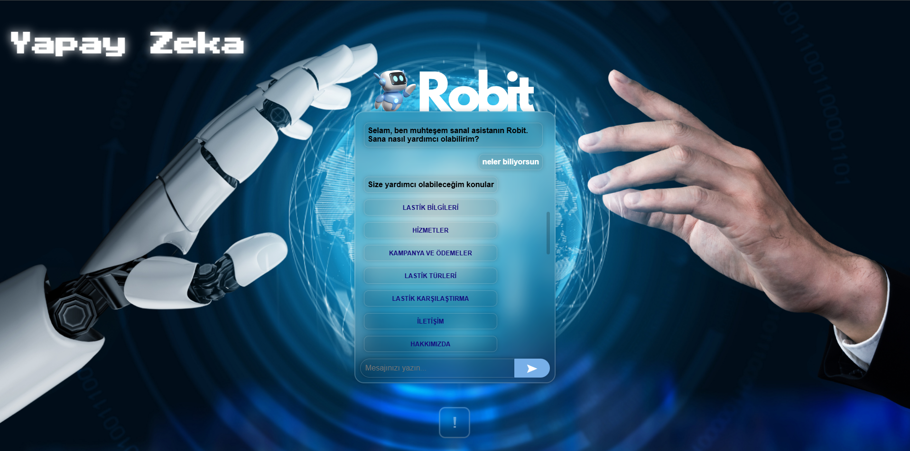
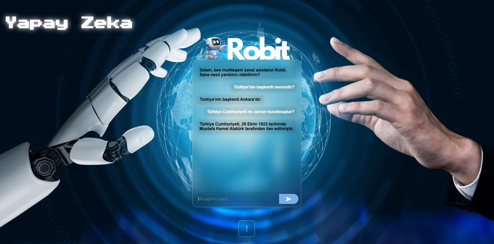
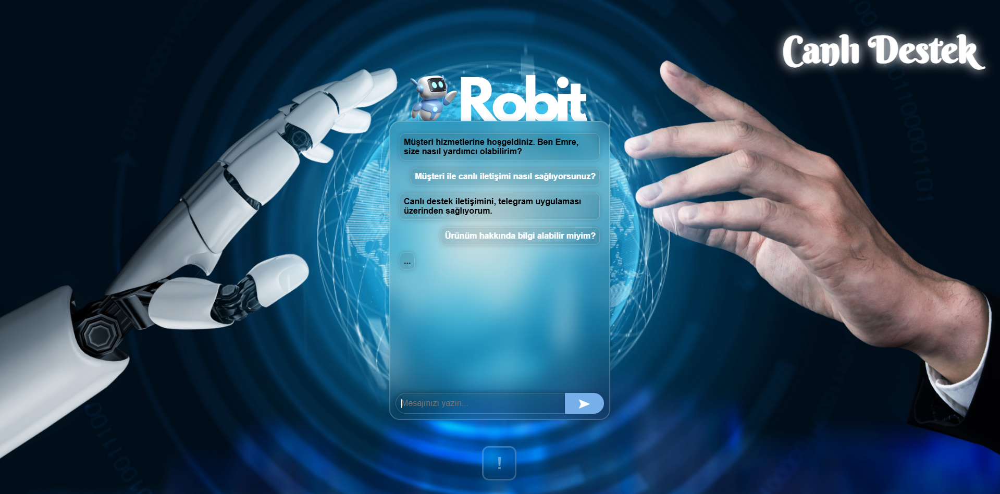
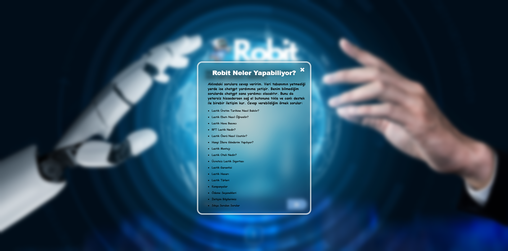
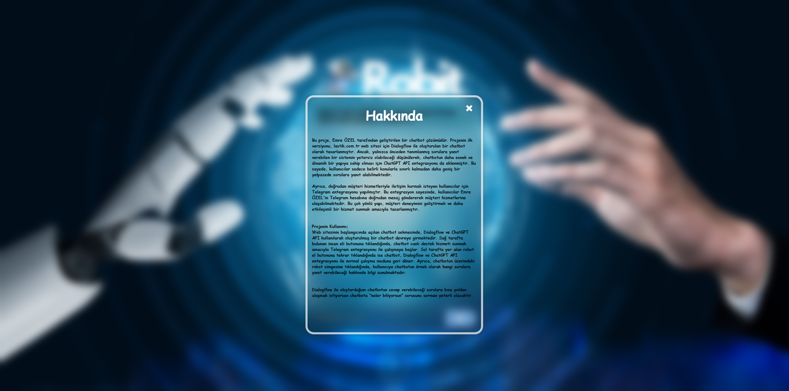

# Robit
### **Proje Tanımı**
Bu proje, Lastik.com.tr için geliştirilen bir chatbot uygulamasıdır. Başlangıç aşamasında, chatbot yalnızca Dialogflow API'si aracılığıyla gelen müşteri sorularını yanıtlayabiliyordu. Zamanla yapılan geliştirmelerle, ChatGPT API entegrasyonu sağlanarak, Dialogflow'un yanıtlayamadığı sorulara da otomatik yanıt verme kabiliyeti eklendi.

Projenin son aşamasında ise canlı destek özelliği entegre edilerek, chatbotun müşterilere Telegram üzerinden gerçek zamanlı destek sunabilmesi sağlandı. Böylece, müşteriler belirli soruları bot ile çözerken, karmaşık veya kişisel sorular için canlı bir destek personeline yönlendirilebiliyor. Canlı destek, Telegram aracılığıyla yürütülmekte olup, bot ile entegre bir şekilde çalışmaktadır.

### **Proje Özellikleri**
- Dialogflow API entegrasyonu ile lastik hakkında sık sorulan sorulara otomatik cevap verme.  
- ChatGPT API entegrasyonu ile karmaşık ve cevaplanamayan sorulara çözüm sunma.  
- Telegram entegrasyonu ile canlı destek hizmeti.
  
**Kullanım Alanı:** Müşteri memnuniyetini artırmak ve destek süreçlerini hızlandırmak için e-ticaret sektöründe uygulanabilir bir chatbot çözümü.

## Proje Görselleri
### Dialogflow üzerinde üretilen chatbotun cevap verebileceği sorular, Dialogflow ile yanıtlanıyor.

### Dialogflow ile cevap alınamayan sorulara ChatGPT API ile cevap alınıyor. 

### Canlı destek için, Telegram üzerinden anlık cevap alınıyor.
(Sağ taraftaki insan eli görseline tıklandığı zaman açılır.)

### Chatbot neler yapabiliyor? 
(Chatbotun üzerindeki robit simgesine tıklandığı zaman açılır.)

### Proje kullanımı hakkında bilgiler.
(Chatbotun altındaki ünlem simgesine tıklandığı zaman açılır.)

